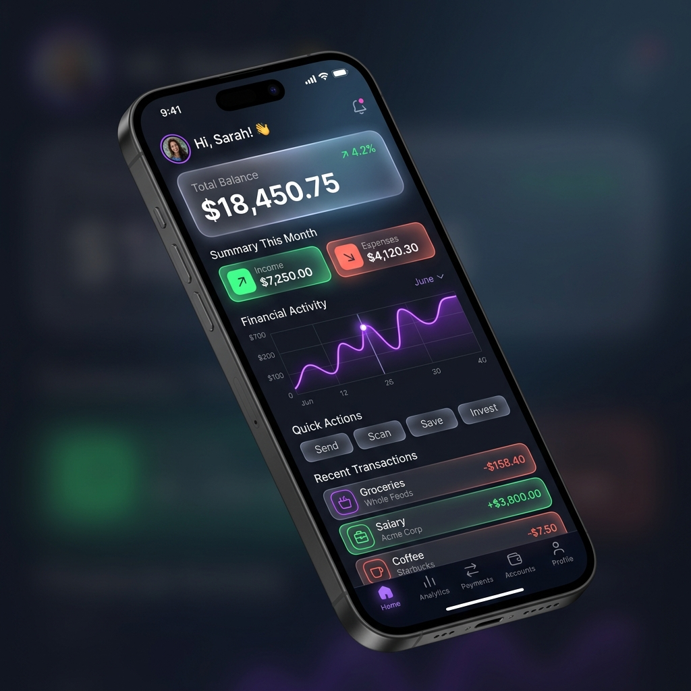

# VibeWallet: Seu Assistente Financeiro Inteligente 💸

Bem-vindo ao repositório do **VibeWallet**, um projeto conceitual desenvolvido como parte do desafio "Vibe Coding" da DIO. Este projeto explora o uso de Inteligência Artificial para ideação, prototipação e documentação de um aplicativo de finanças pessoais.

## 📱 Resumo do Conceito

O **VibeWallet** é um aplicativo de organização financeira focado no público jovem (Millennials e Gen Z) que busca entender e controlar seus gastos sem a complexidade das planilhas tradicionais. 

**Principais Funcionalidades:**
- 📊 **Dashboard Dinâmico:** Visualização clara de receitas e despesas com gráficos interativos e intuitivos.
- 🤖 **Categorização por IA:** Leitura automática e categorização inteligente de gastos.
- 🎯 **Vibe Check (Diferencial):** Um resumo semanal gerado por IA com insights e dicas em um tom descontraído e amigável (ex: *"Sua vibe de gastos em delivery está alta essa semana! Que tal cozinhar em casa no fim de semana para focar na meta?"*).
- 🌙 **Design Moderno:** Interface em Dark Mode nativo com elementos de *glassmorphism* e micro-interações.

---

## 📝 Prompt Final (PRD) utilizado

Para gerar a base conceitual e a estrutura visual deste projeto com as IAs (como GitHub Copilot / Lovable), foi utilizado o seguinte PRD (Product Requirements Document) estruturado em formato de prompt:

> **Atue como um Engenheiro de Software Sênior e UI/UX Designer.**
> 
> **Objetivo:** Criar o escopo e o design system de um aplicativo de finanças pessoais chamado "VibeWallet". 
> 
> **Público-alvo:** Jovens adultos que buscam praticidade e uma relação mais leve com o dinheiro.
> 
> **Requisitos Visuais:** 
> - Tema principal: Dark Mode.
> - Estilo: Moderno, clean, com uso de "glassmorphism" nos cards.
> - Paleta de cores: Fundo escuro (cinza carvão), destaques em Roxo Neon (marca primária), Verde Esmeralda (positivos/entradas) e Vermelho Coral (alertas/saídas).
> 
> **Telas Principais a serem geradas:**
> 1. **Home/Dashboard:** Resumo do saldo atual, gráfico de rosca com as top 3 categorias de gastos, e lista das últimas transações.
> 2. **Tela "Vibe Check":** Interface conversacional onde a IA do app envia insights semanais baseados no comportamento financeiro do usuário, usando linguagem natural e emojis.
> 3. **Adicionar Transação:** Formulário simples para inserir gastos manuais com foco em usabilidade mobile.
> 
> **Regras de Negócio:**
> - Permitir criar metas mensais (ex: "Gastar até R$ 500 em Lazer").
> - A IA deve emitir um alerta amigável quando o usuário atingir 80% da meta de uma categoria.
> 
> **Saída esperada:** Resumo arquitetural do projeto, paleta de cores detalhada e código gerado (React/Tailwind) para a tela Home.

---

## 📸 Demonstração / Visualização

Abaixo, a interface de Dashboard gerada a partir das interações com a IA baseada no nosso PRD:

---

## 🧠 Reflexão e Aprendizados no Processo

Durante a execução deste desafio de *Vibe Coding*, pude vivenciar na prática o poder transformador das ferramentas de IA generativa no ciclo de desenvolvimento de software.

**Principais aprendizados:**
1. **Engenharia de Prompt é a Nova Fundação:** A qualidade do resultado entregue pela IA (seja para geração de código ou design) é diretamente proporcional à clareza e ao nível de detalhes estruturados no prompt inicial (o PRD). Contexto é rei.
2. **Aceleração da Prototipação:** O que antes levaria horas de ideação e criação de wireframes, tomou forma em minutos. A IA atua como um excelente catalisador de produtividade criativa.
3. **Mudança de Paradigma (De Digitador para Diretor):** Com a IA assumindo o "trabalho braçal" e a estrutura básica do projeto, o papel do desenvolvedor se eleva. O foco passa a ser refinar a lógica de negócios, revisar a arquitetura e garantir a excelência da experiência do usuário.
4. **Colaboração e Refinamento:** O *Vibe Coding* é, por natureza, iterativo. A IA não substitui o julgamento humano; ela exige que saibamos avaliar, ajustar e conduzir as respostas para que o produto atinja os objetivos propostos com perfeição.

---
*Projeto entregue para o desafio prático de Vibe Coding do bootcamp da Digital Innovation One (DIO).*
